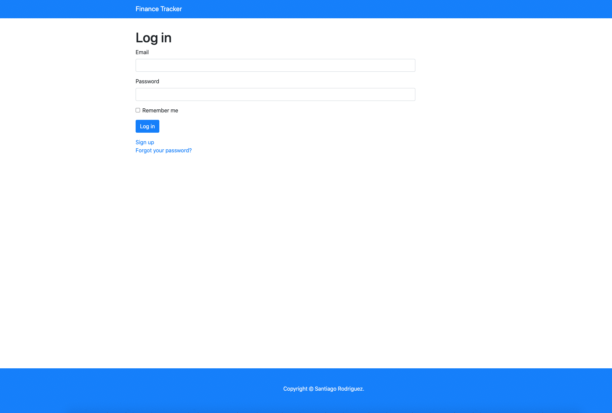

<!-- place all the badges here -->


# Finance Tracker

[live version](https://srodrig-finance-tracker.herokuapp.com)



This is an application for tracking stocks, the idea is this, there are users
that have portfolios, each portfolio can have a maximum of 10 stocks to track,
and each user can have friends that you can search by name or email. Friends
have their own portfolios that the user can see, optionally, the user can
track the stocks of their friends.

## Table of contents

- [Requirements](https://github.com/santiago-rodrig/finance_tracker#requirements)
- [Setup](https://github.com/santiago-rodrig/finance_tracker#setup)
- [Collaboration](https://github.com/santiago-rodrig/finance_tracker#collaboration)
- [License](https://github.com/santiago-rodrig/finance_tracker#license)
- [Contact](https://github.com/santiago-rodrig/finance_tracker#contact)

## Requirements

- [Rails](https://rubyonrails.org/) (~> 6.0.3)
- [Ruby](https://www.ruby-lang.org/en/) (~> 2.6.6)
- [Bundler](https://bundler.io/v2.1/#getting-started) (2.1.4)
- [Node](https://nodejs.org/en/) (~> v14.5.0)
- [Yarn](https://yarnpkg.com/getting-started/install) (~> 1.22.4)
- [SQLite](https://www.sqlite.org/index.html) (~> 3.28.0)

## Setup

First, clone the repository.

```sh
git clone https://github.com/santiago-rodrig/finance_tracker.git && \
cd finance_tracker
```

Install the dependencies.

```sh
bundle config set without 'production' && \
bundle install
```

Run the migrations.

```sh
rails db:migrate
```

Start the local web server.

```sh
rails server
```

Visit [localhost at port 3000](http://localhost:3000) and interact with the application.

## Collaboration

To collaborate to this project first fork the repository, after that, create a new branch based
on [develop](https://github.com/santiago-rodrig/finance_tracker/tree/develop)
(using [Git-flow](https://nvie.com/posts/a-successful-git-branching-model/)
is recommended), push your branch to your forked repository and create a PR (Pull Request)
from your branch to the develop branch of the original repository.

## License

Specify the license. You can [read the license here](./LICENSE).

## Contact

You can reach out to me through the following URLs.

- [My website](https://santiagorodriguez.dev)
- [Github](https://github.com/santiago-rodrig)
- [LinkedIn](https://www.linkedin.com/in/santiago-andres-rodriguez-marquez/)
- [AngelList](https://angel.co/u/santiago-andres-rodriguez-marquez)
- [santo1996.29@gmail.com](mailto:santo1996.29@gmail.com)
